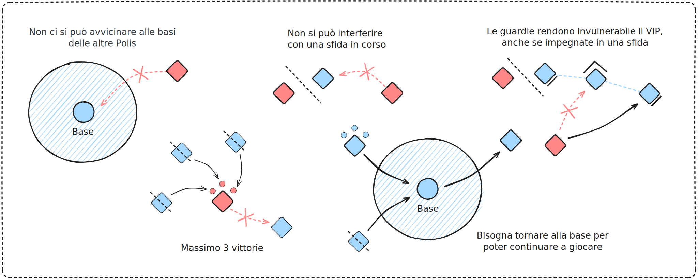
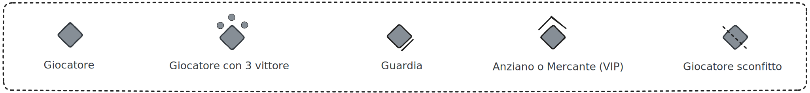

 
# Regole

## Come si gioca

### Idea
Le squadre rappresentano delle grandi città nella valle di Valagola, tutte vogliono diventare la più grande e potente. Sono in competizione per le risorse e si sfidano in giochi e combattimenti individuali per costruire nuovi edifici. Per poter avanzare il livello delle città è necessario costruire edifici, per costruire gli edifici servono le risorse. Vince la squadra che raggiunge per prima la costruzione della **Torre di Babele**. Dopo la sua vittoria l’intera valle viene colpita dall’ira di Dio e tutte le Polis cadono. Tutti gli anni i ragazzi si sono sempre divertiti a questo gioco a prescindere dalla sua durata.

### Durata
Il gioco ha una durata molto lunga, generalmente viene risolto completamente in 1 giornata e mezza. Per come è strutturato permette di inserire altre attività secondarie (minigiochi) all'interno della partita per evitare che diventi monotono. 1 giornata con le risorse suggerite non è sufficiente a completare il gioco creando la Torre di Babele, ma permette in ogni caso di dare i punti finali basandosi sulle strutture costruite. Per velocizzare i tempi senza continuare il gioco si possono organizzare altre attività che fanno guadagnare denaro alle Polis, come ad esempio le Olimpiadi (tornei), e usare quel denaro per finire la costruzione degli edifici mancanti. 

### Materiale
Per giocare è necessario munirsi di scalpi per tutti i giocatori, un simbolo di squadra da posizionare dove viene fondata la città e di numerosi token per rappresentare le varie risorse e il denaro. Si consiglia almeno 600 token per ogni tipologia, in passato sono stati usati quadratini colorati in cartone. Inoltre è consigliabile creare un cartellone con una griglia Polis-Edifici dove segnare le strutture completate, i ragazzi possono disegnarle nell'apposita cella.

### Reskin
Ovviamente tutte le parole chiave utilizzate in questo documento sono opzionabili e modificabili.
Le *Polis* possono diventare *Navi*, e gli edifici componenti di queste navi. I *Mercenari* possono diventare i *Pirati*, gli *Anziani* i *Capitani*, gli *Abitanti* i *Membri della Ciurma*. I materiali possono passare da Legno, Ferro e Pietra a Unubuptanio, Titanio e Cuori di Stella. Nulla è fisso se non le regole di base.

## Risorse

### Materiali
Ogni Polis produce un singolo tipo di risorsa materiale. Ogni 10 minuti la **Banca** assegna alla squadra un numero variabile di punti materiale, generalmente 5, che può essere regolato per velocizzare o rallentare il gioco. I materiali generati in **Banca** rimangono in banca fino a quando un membro della Polis non viene a ritirarli. L'interno della **Banca** è considerato luogo sicuro e non si può essere sfidati.

### Denaro
Il **Denaro** è una particolare tipologia di risorsa che può essere acquisita dai giocatori risolvendo delle **Quest** offerte dagli animatori. Il **Denaro** permette l'acquisto diretto in **Banca** di tutte le altre tipologie di risorse. Offre una via alternativa oltre al conflitto. Il costo delle risorse in denaro può essere variabile, ma se si preferisce un'opzione più semplice si può fissare il costo a 5 denari per 1 risorsa qualsiasi.

## Quest
Gli animatori viaggiano per l'area di gioco e offrono delle *Quest* (minigiochi) ai ragazzi. In caso di vittoria questi ricevono del denaro che possono depositare nella loro Polis, verrà sfruttato dal *Mercante* di squadra. Le *Quest* possono essere di qualsiasi tipo, sfide fra giocatori, indovinelli, prove fisiche. Si può anche premiare i giocatori direttamente con materiali, per esempio una prova di forza di lancio del tronco può avere come ricompensa del legno invece del denaro.

## Ruoli

In ogni squadra i giocatori si dividono in 4 ruoli distinti, ognuno con le proprie abilità e responsabilità: **Anziani**, **Mercanti**, **Guardie**, **Abitanti**. Se possibile è consigliabile segnare con una fascia colorata univoca gli anziani, i mercanti e le guardie per facilitarne l'identificazione durante il gioco.

| Nome | Descrizione |
| ----------- | ----------- |
| **Anziano** | Ogni Polis ha un singolo Anziano, questo è l’unico in grado di costruire gli edifici della città recandosi in Banca e pagando le risorse richieste. Può essere difeso dalle Guardie.       |
| **Mercante**| Ogni Polis ha un singolo *Mercante*, questo è l'unico in grado di scambiare il denaro in risorse alla *Banca* e può commerciare liberamente con altri mercanti. Può essere difeso dalle *Guardie*.        |
| **Guardie** | Ogni Polis ha 3 *Guardie*, hanno il compito di proteggere l'*Anziano* e/o il *Mercante* durante i loro spostamenti. Infatti il loro protetto non può essere sfidato fino a quando c'è almeno una guardia a 5 metri ancora in vita *o impegnata in un combattimento*. |
| **Abitanti**| Tutti i rimanenti giocatori della Polis sono *Abitanti*, possono attaccare i giocatori delle altre Polis per rubare le loro risorse e dedicarsi alle *Quest* offerte dagli animatori per guadagnare denaro. |

> [!tip] Partecipazione estesa
> 
> Come regola opzionale si possono estendere le azioni di attacco e i minigiochi a tutti i ruoli e non solo agli *Abitanti*. In questo modo si evitano attese noiose e tutti hanno sempre qualcosa da fare. Quando i ruoli speciali non stanno svolgendo le loro particolari funzioni sono considerati abitanti normali ai fini del gioco. 

> [!tip] Bandiera in transito
> 
> Per rendere più interessante il gioco si può limitare il *Mercante* e l'*Anziano* a svolgere le loro funzioni in *Banca* **solo se in possesso della loro bandiera ben visibile**. In questo modo i convogli carichi di risorse delle città sono ben visibili alle altre squadre durante gli spostamenti e si incentivano gli assalti con grandi vincite. Questo può velocizzare di molto il gioco.

## Come si gioca

### Combattimento

Se i giocatori sono oltre 10 metri dalla base delle Polis possono sfidarsi in due diversi modi: *Sasso-Carta-Forbice* e *Scalpo*. Il primo modo è utilizzabile solo se entrambi gli sfidanti sono d'accordo e pronti a lasciare tutto al fato. Se non si è d'accordo su quale metodo utilizzare vince sempre *Scalpo*. Per cominciare una sfida è necessario che i 2 giocatori si tocchino, è quindi possibile evitare le sfide essendo più veloci degli altri e non facendosi toccare. Lo scalpo consigliato è quello 1v1 ad una mano. E quindi vietato interferire con una sfida in corso, sarà possibile attaccare il vincitore solo dopo che la sfida in corso sia conclusa. 

### Sconfitta
Propongo due possibile strategie per gestire le sconfitte a scalpo, una semplice ma dove è facile imbrogliare rovinando il gioco e una più lunga ma più sicura. 

| Variante | Descrizione |
| ----------- | ----------- |
| **Timeout** | In questa versione il perdente a scalpo tiene la propria coda ma deve aspettare immobile per almeno 1 minuto prima di tornare in gioco. Non ci sono garanzie che il timeout venga rispettato se non è presente un animatore nel campo di battaglia. |
| **Respawn** | In questa versione il perdente, oltre alle risorse, perde anche la sua coda e deve tornare nella propria Polis o in *Base* per ottenerne una nuova. Come regola opzionale si può limitare il numero massimo di code che un ragazzo può rubare a 3, costringendolo a tornare in Polis o in *Base* a depositarle. In questo modo i ragazzi forti ogni tot. devono allontanarsi dalle zone calde della partita, lasciando libero respiro agli altri. |

> [!tip] Taglie
> 
> Un'opzione interessante per rendere più dinamico il gioco è quella di introdurre un animatore speciale, il **Cacciatore di Taglie** che offre ricompense in denaro per l'eliminazione di ragazzi particolarmente forti durante la partita. Si possono utilizzare le fascette di Alce Rossa come code da scalpo. Il cacciatore assegna un premio in denaro ad una particolare coda, se qualcuno riesce ad ottenerla e portarla al cacciatore allora riceve la ricompensa in denaro e la taglia viene annullata. Il **Cacciatore di Taglie** può rimanere fisso in **Base** oppure spostarsi nell'area di gioco.

> [!tip] Mercenari
> 
> Un'altra opzione interessante per animare il gioco è quella di introdurre i **Mercenari**, animatori che possono essere pagati in denaro dal *Mercante* per attaccare le altre Polis durante gli spostamenti dei convogli e riportare tutte le risorse ottenute al pagante. Si consiglia di chiedere molto denaro per questi coinvolgimenti degli animatori (100+ denari), in quanto generalmente sono tatticamente più furbi degli animati, non hanno nulla da perdere e fanno stragi. I **Mercenari** possono essere assoldati in **Base**.

## Edifici

### Costo
Per vincere il gioco è necessario costruire edifici della Polis, ogni edificio ha un costo in materiali espresso in questo modo: **QxT**, dove Q è un numero di materiali e T è la tipologia di materiale. T può essere di 3 tipi: **MP**, **MNP**, **M**.

MP significa Materiale-Polis, quindi l'elemento di riferimento di quella Polis. MNP significa Materiale-Non-Polis, quindi qualsiasi materiale che non sia della Polis in questione. M invece sta per Materiale generico senza limitazioni.

### Tabella degli edifici
| Livello | Nome | Costo | Quantità | Descrizione |
| ----------- | ----------- | ----------- | ----------- | ----------- |
|1| **Strada** | 8xMP + 4xMNP | 4 | Una semplice strada in ciottoli. |
|2| **Abitazione** | 5x3M | 4 | Una casa per numerosi plebei. |
|3| **Castello** | 12x4M | 1 | Un’imponente struttura militare. |
|4| **Porto** | 35xM | 1 | Navi partono per paesi lontani. |
|5| **Torre di Babele** | 50xM | 1 | La torre più alta del mondo per sfidare Dio. |

### Punteggio
Per dare il punteggio finale del gioco si ordinano le squadre in base al numero di edifici costruiti. In caso di pareggio vince la squadra con il maggior numero di denaro ancora disponibile. Se la creazione degli edifici è stata lasciata libera allora si somma il numero di edifici costruiti moltiplicato per il rispettivo livello. Ad esempio se sono state costuire 3 case e 1 porto dalla Polis, il suo punteggio finale è 3x1+1x4.
In ogni caso la prima Polis a creare la Torre di Babele vince il primo posto.

> [!tip] Bonus passivi
> 
> Come regola opzionale gli edifici costruiti possono offrire bonus passivi alle Polis, come un aumento nel numero di risorse generate ogni 10 minuti per ogni **Abitazione**, oppure sconti ai **Mercanti** se la Polis possiede un **Porto**.

> [!tip] Costruzione libera
> 
> In alternativa alla creazione della Polis per livelli si può lasciare libera scelta agli Anziani su quali strutture costruire per prime. Tenendo come unica limitazione per la costruzione della Torre di Babele la creazione di tutti gli altri edifici nelle quantità presenti in tabella.